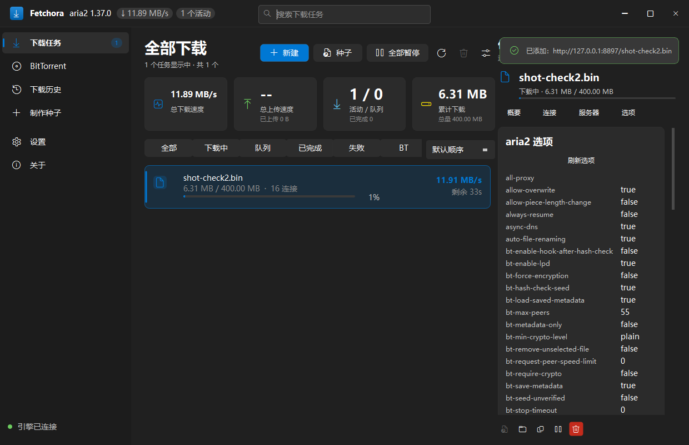

<div align="center">


# Fetchora

**An aria2-powered download manager with a Fluent 2 / WinUI 3 interface, built with Qt 6 Widgets.**

Multi-protocol downloads · BitTorrent · tracker manager · Windows, macOS, Linux

[](LICENSE)
[](https://github.com/aimineng/Fetchora/actions/workflows/ci.yml)
[](https://github.com/aimineng/Fetchora/releases)

[简体中文](README.zh-CN.md)

</div>



## Features

- **Downloads** — HTTP, HTTPS, FTP, SFTP, BitTorrent and Metalink through [aria2](https://aria2.github.io/)
  (1.37.0 ships with the app). Several connections per file, resume, queues, speed limits,
  mirrors, per-task proxy, and a magnet field that takes several links at once.
- **BitTorrent** — magnets and `.torrent` files, DHT/DHT6, PEX, LPD, MSE, seeding limits.
  Torrents are ordinary rows in the download list (the `BT` chip filters for them).
- **Tracker manager** — subscribe to published lists (ngosang, XIU2), keep a blacklist, see
  per-tracker health read from aria2's own announce log, sync on demand. One task's trackers
  are edited in its details.
- **Details pane** — overview, connections, servers, trackers and the live aria2 options,
  updated in place so it does not flicker while a download runs.
- **History** — finished, failed and removed tasks in SQLite, searchable and filterable.
- **Interface** — dark and light Fluent themes, Mica on Windows 11, Chinese and English.
- **Extras** — torrent creator/editor, update check, tray icon, HTTP bridge and a companion
  browser extension in `Plugin/`.

## Requirements

Qt **6.5+** (developed against 6.10.3), CMake 3.21+, a C++17 compiler. Windows release
packages bundle the engine; on macOS and Linux install `aria2` with your package manager.

## Build

```bash
cmake -S . -B build -DCMAKE_BUILD_TYPE=Release
cmake --build build --parallel
```

The binary lands in `build/` (`build/Release/` with MinGW Makefiles). Put `third_party/aria2`
next to it, or have `aria2c` on `PATH`.

```bash
./build.ps1                           # Windows wrapper (add -Sign with a signing certificate)
tools/check-engine-supervision.ps1    # end-to-end engine checks, needs a running app
ctest --test-dir build                # unit tests: the parsers, no engine or window
Fetchora --self-test                  # parsers, settings and the aria2 command line
```

## Notes

- **Smart App Control** can block a freshly built, unsigned `Fetchora.exe`; turn it off in
  Windows Security → App & browser control when building from source.
- The engine is supervised: if `aria2c` dies, Fetchora restarts it and the queue continues.
- Settings, history and logs live in `%APPDATA%\Fetchora` and `%LOCALAPPDATA%\Fetchora`.

## Command line

```
Fetchora [options] [URL|magnet|.torrent ...]
  --page <key>            download | tracker | history | createtorrent | settings | about
  --detail <section>      overview | peers | servers | tracker | options
  --sync-trackers         fetch every tracker subscription source and exit
  --self-test             run the built-in checks and exit
  --make-torrent <dir>    build a .torrent from a folder or file
  --inspect-torrent <file>  print what a .torrent contains
  --screenshot <file>     render a page and exit (--frames takes a series)
```

## License

MIT — see [LICENSE](LICENSE). aria2 is GPLv2+ and ships as a separate executable.
