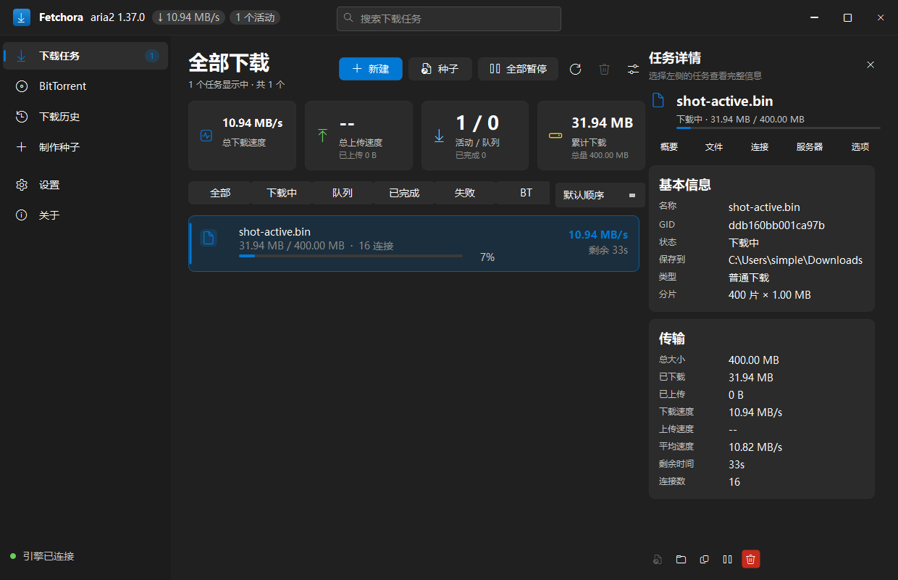
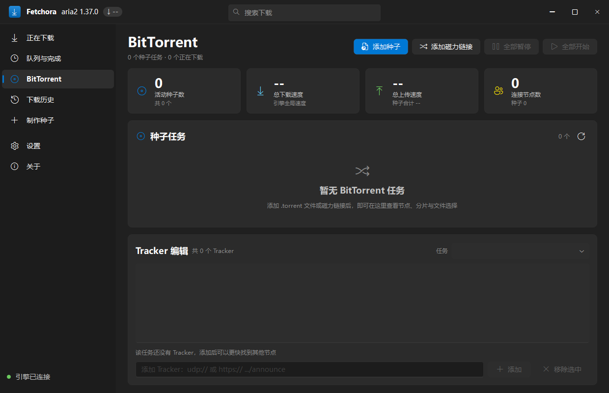
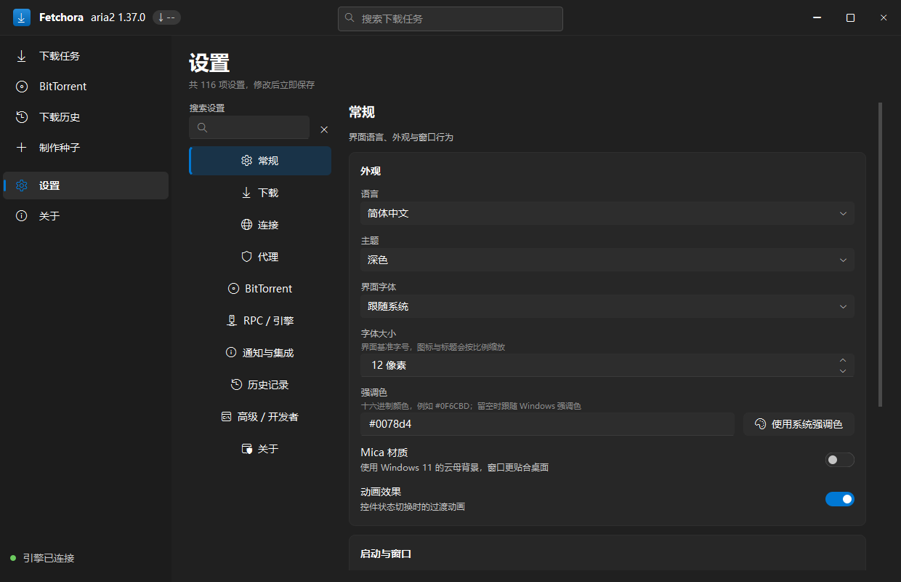
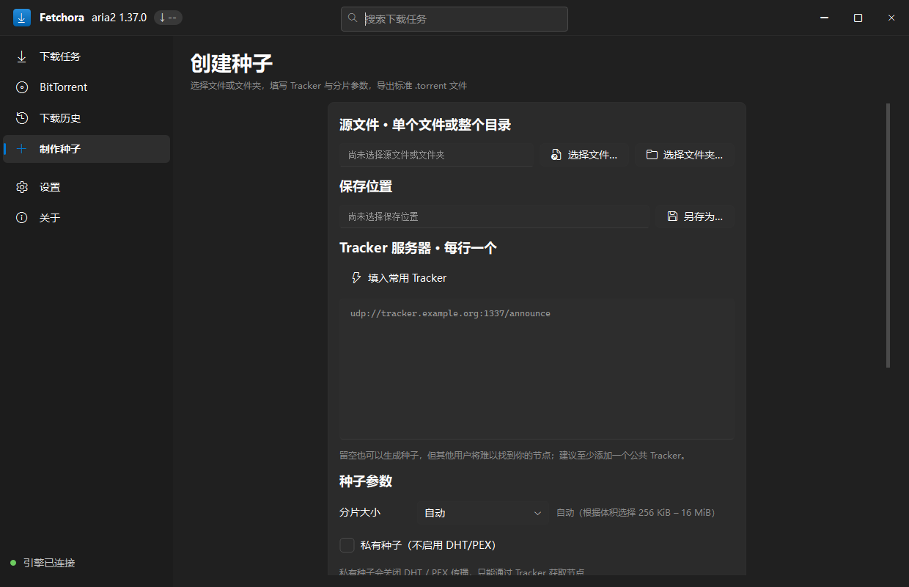
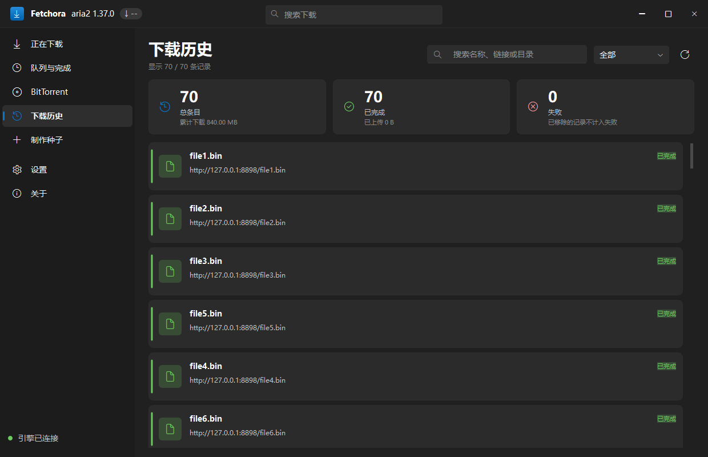
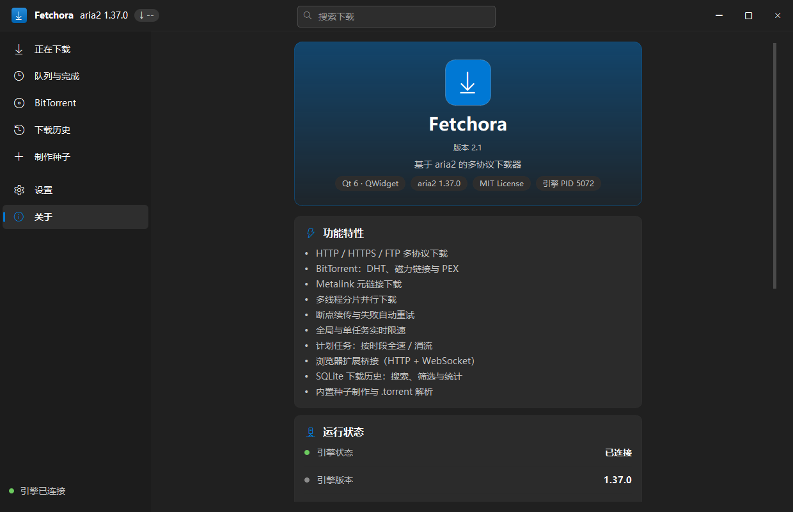

<div align="center">


# Fetchora

**一个快速、美观、基于 aria2 的下载器，支持 Windows、macOS 与 Linux。**

多协议下载 · 完整 BitTorrent 客户端 · 用 Qt 6 Widgets 实现的
Fluent 2 / WinUI 3 界面 —— **完全没有 QML**。

[](LICENSE)
[](https://github.com/aimineng/Fetchora/actions/workflows/ci.yml)
[](https://github.com/aimineng/Fetchora/releases)
[](https://www.qt.io/)
[](#运行环境)
[](#从源码构建)

[English](README.md) · [功能](#功能) · [构建](#从源码构建) · [快捷键](#快捷键) · [常见问题](#常见问题)

</div>

---

## 为什么还要再写一个下载器？

因为快的那些界面停留在 2009 年，而好看的那些又不够快。Fetchora 把久经考验的
[aria2](https://aria2.github.io/) 引擎放在一个真正遵循 Windows 11 设计语言的界面后面：
Mica 材质、分层表面、1px 提亮描边、系统强调色、Segoe Fluent Icons 图标与
Segoe UI Variable 字体。

引擎能做的事全都开放出来了，没有"敬请期待"的占位功能。

在 macOS 与 Linux 上，同一套界面运行在普通的原生窗口里：Mica 背景、系统强调色读取和
Fluent 图标字体都是 Windows 独有的，因此窗口保留平台自己的边框与标题栏，字体回退到
系统自带字体，深浅色也按系统默认值来。其余功能（下载、BitTorrent、历史、种子制作、
浏览器桥接、桌面提供托盘时的托盘图标）完全一致。

## 功能

### 下载能力
- **HTTP / HTTPS / FTP / SFTP**，多连接分片下载。
- **BitTorrent** —— 磁力链接、`.torrent` 文件、DHT、DHT6、PEX、LPD、MSE 加密、
  元数据交换、做种比率/时间限制、逐任务编辑 Tracker。
- **Metalink**（`.metalink` / `.meta4`），自动选择镜像。
- **断点续传**，重启程序后依然继续，并保持 aria2 会话。
- **单任务与全局限速**、每服务器连接数上限、磁盘缓存调优。
- **队列管理** —— 上移 / 下移 / 置顶等待中的任务，全部暂停与全部开始。
- 多文件种子支持**按文件选择**下载。
- **计划任务** —— 在每天的时间窗内启停引擎并切换限速。

### 界面
- **Fluent 2 / WinUI 3** 设计：Mica 背景、圆角、真正的深/浅色主题、系统强调色，
  以及完全由 C++ 手绘的 Fluent 开关、滑块、下拉框与进度条 —— 与 Windows 11
  原生控件一致，而不是"看起来有点像"。
- **无边框窗口**，标题栏行为与原生一致（贴靠布局、双击最大化、拖拽还原都可用）。
- **实时统计** —— 下载/上传速度、活动/队列/已完成计数、累计流量、任务真实平均速度。
- **任务详情面板** —— 概要数据、逐文件进度、已连接用户、服务器/镜像，以及该任务
  完整的 aria2 选项表。
- **下载历史**保存在 SQLite 中，可搜索、可筛选，一键重新下载，还有批量选择模式一次删除多条。
- **种子制作** —— 生成完全符合标准的 `.torrent`（Tracker 分层、Web Seed、私有标记、
  自动分片长度），并可解析任意现有种子。
- **命令栏 + 状态筛选 + 搜索**、键盘快捷键、带实时速度提示的托盘图标、原生通知。
- **简体中文 / English** 界面，运行时即时切换。

### 集成
- **浏览器扩展**（Manifest V3，Chromium 系）通过自建的 WebSocket 桥接把浏览器下载、
  磁力链接和 `.torrent` 文件交给本程序 —— 见 [`Plugin/`](Plugin)。
- **JSON-RPC 服务端**，任何第三方 aria2 客户端都能驱动同一个引擎。
- **单实例** —— 再次启动会把链接转发给已打开的窗口。
- **命令行** —— 直接传入链接、磁力链接或 `.torrent` 路径。

### 可靠性
- **引擎不会比程序活得更久。** aria2c 启动时带上 `--stop-with-process=<本程序 PID>`，所以只要 Fetchora 不在了——不管是怎么没的——它自己就会正常退出（会话文件照常保存）；Windows 上它还跑在一个 kill-on-close 的 job object 里，这一层不依赖引擎配合。崩溃、任务管理器结束进程、调试器中断都不会留下一个偷偷下载的孤儿进程。
- **引擎会自我恢复** —— 运行期间 aria2c 被杀掉的话，几秒内会自动重启，并且"挂了"和"回来了"都会告诉你。
- **日志自动打理** —— 一天一个文件、超过 4 MB 自动切分、7 天后自动清理（可设置），崩溃时还会写下 minidump 与返回地址。详见[日志与崩溃报告](#日志与崩溃报告)。

## 截图

由真实窗口抓取：`Fetchora --page <页面> --screenshot shot.png --screenshot-delay 6000`
（Windows 下为 `Fetchora.exe`）。

**下载列表（含任务详情面板）**



| BitTorrent | 设置 |
| --- | --- |
|  |  |

| 制作种子 | 下载历史 |
| --- | --- |
|  |  |



> `QWidget::grab()` 会把半透明的 Mica 窗口与桌面合成，因此截图比真实窗口更亮。
> 上面的截图是在关闭 Mica 的状态下抓取的，这样能看清真实的表面颜色；除了背景色调，
> 两种状态下的界面完全一致。`tools/capture-ui.ps1` 可以复现全部截图。

## 运行环境

### 安装

| 平台 | 方式 |
| --- | --- |
| Windows 10/11 (x64) | 运行 `Fetchora-*-windows-x64-setup.exe`。不需要管理员权限，**已内置 aria2**。 |
| Windows 免安装 | 解压 `Fetchora-windows-x64.zip` 到任意目录，运行 `Fetchora.exe`。内容与安装包相同，同样内置引擎。 |
| macOS | 打开 `Fetchora-macos-*.dmg`，把 Fetchora 拖进"应用程序"。 |
| Linux | 解压 `Fetchora-linux-*.tar.gz`；所需的 Qt 包见 Release 说明。 |

下载地址：[Releases](https://github.com/aimineng/Fetchora/releases)。

### 运行
| | |
| --- | --- |
| 系统 | Windows 10 1809+、macOS 12+，或现代 Linux 桌面（X11 / Wayland） |
| 引擎 | `aria2c` **1.36 或更高** —— Windows 安装包与免安装包已内置，macOS / Linux 需自行安装 |
| 运行库 | Qt 6 运行时（Windows 用 `windeployqt`；其他平台用包管理器或 `macdeployqt`） |

Mica 与窗口圆角需要 Windows 11 22H2+，在 Windows 10 上窗口直接用不透明表面绘制。
macOS 与 Linux 使用系统原生窗口边框与标题栏。

**引擎从哪来。** Windows 的两个包内置了 aria2 1.37.0 官方构建，下载后开箱即用。
macOS 和 Linux 的包**不内置**：`brew` / `apt` 构建出来的 aria2 会动态链接到该系统自己的
库，只复制可执行文件的话换台机器就跑不起来，所以请用 `brew install aria2` 或发行版的包
管理器安装。

没有内置引擎时，查找顺序为：设置 → RPC/引擎 中配置的路径 → 程序目录（macOS 应用包内还会
找 `Contents/Resources`）→ `/opt/homebrew/bin` → `/usr/local/bin` → `/usr/bin` → `PATH`。

### 构建
| | |
| --- | --- |
| 编译器 | Windows：MinGW-w64 GCC 13+ **或** MSVC 2019+；macOS / Linux：系统自带的 Clang / GCC（C++17） |
| Qt | 6.5 或更高 —— 需要 `Widgets`、`Network`、`Sql`、`Svg`、`Concurrent`、`LinguistTools` |
| CMake | 3.21 或更高 |

## 从源码构建

三个平台都用 CMake 构建，附带的脚本只是把"配置 + 编译 + 自检"包了一层。

### 依赖安装

| 平台 | 安装命令 |
| --- | --- |
| Windows | Qt 6.5+ 与 MinGW-w64 GCC 13+（或 MSVC 2019+） |
| macOS | `brew install qt aria2` |
| Debian / Ubuntu | `sudo apt install build-essential cmake qt6-base-dev qt6-svg-dev libqt6sql6-sqlite aria2 ca-certificates` |
| 其他 Linux | 同样的四个 Qt 组件，换成对应发行版的包名（`qt6-base-devel`、`qt6-svg-devel` 与 Qt 6 的 SQLite 驱动） |

Debian/Ubuntu 上 SQLite 驱动是单独的包（`libqt6sql6-sqlite`，`qt6-base-dev` 只是推荐它），
`qt6-svg-dev` 用于 SVG 图标支持；`LinguistTools` 各发行版都随 Qt 基础开发包提供。

### Windows（PowerShell）

```powershell
git clone https://github.com/aimineng/Fetchora.git
cd Fetchora

# Debug 构建
.\build.ps1

# Release 构建并启动
.\build.ps1 -Release -Run

# Release 构建 + 无界面自检
.\build.ps1 -Release -Test

# Release 构建 + 生成带 Qt 运行时的便携目录
.\build.ps1 -Release -Deploy
```

`build.ps1` 假设 Qt 使用默认安装布局，不一致时自行覆盖：

```powershell
.\build.ps1 -Release `
    -QtDir    "C:\Qt\6.10.3\mingw_64" `
    -MingwDir "C:\Qt\Tools\mingw1310_64" `
    -CMake    "C:\Qt\Tools\CMake_64\bin\cmake.exe"
```

### macOS

```sh
brew install qt aria2
git clone https://github.com/aimineng/Fetchora.git
cd Fetchora

./build.sh              # Release 构建，自动定位 Homebrew 的 Qt
./build.sh --test       # 构建 + 无界面自检
./build.sh --run        # 构建并启动
```

产物是应用包 `build/Release/Fetchora.app`，从终端启动：

```sh
open build/Release/Fetchora.app
# 想直接看它的标准输出：
build/Release/Fetchora.app/Contents/MacOS/Fetchora --self-test
```

`build.sh` 通过 `brew --prefix qt` 获取 Qt 前缀；如果用 Qt 官方安装器，自己指定：

```sh
QT_PREFIX="$HOME/Qt/6.10.3/macos" ./build.sh
```

想让应用包自带 Qt 框架（拷进 `Contents/Frameworks`）：

```sh
"$(brew --prefix qt)/bin/macdeployqt" build/Release/Fetchora.app
```

`aria2` 是外部程序，`macdeployqt` 不会把它打进包里；`build.sh` 会把 Homebrew 的
`aria2c` 复制到 `Contents/Resources/`，程序会在那里找到它。正式分发时更推荐声明依赖
（Homebrew 与 MacPorts 都有 `aria2`），或者自行打包一个签过名的副本。

### Linux

```sh
sudo apt install build-essential cmake qt6-base-dev qt6-svg-dev libqt6sql6-sqlite aria2 ca-certificates
git clone https://github.com/aimineng/Fetchora.git
cd Fetchora

./build.sh              # Release 构建 -> build/Release/Fetchora
./build.sh --test       # 构建 + 无界面自检
./build.sh --run        # 构建并启动
./build.sh --install --prefix "$HOME/.local"   # 安装程序、桌面项与图标
```

可执行文件是 `build/Release/Fetchora`；`build.sh` 在能找到时会把 `aria2c` 与
`ca-bundle.crt` 复制到它旁边，因此无需任何配置就能找到引擎。

`cmake --install` 还会把 `fetchora.desktop` 安装到 `<prefix>/share/applications`，
把 `fetchora.png` 安装到 hicolor 图标主题，这样应用会出现在桌面环境的应用菜单里。
不想跑 CMake 的打包者可以直接使用 `packaging/fetchora.desktop`。

托盘图标需要桌面提供 StatusNotifier 宿主（或旧的 XEmbed 托盘）。没有宿主时程序会自动
检测到并记录下来，此时"关闭窗口"就是**退出程序**，而不是把窗口藏进一个并不存在的托盘。

### 直接用 CMake

```sh
cmake -S . -B build/Release -DCMAKE_BUILD_TYPE=Release
cmake --build build/Release --parallel
```

Windows + MinGW 需要额外指定生成器与 Qt 前缀（见上面的 PowerShell 写法）。产物位于
`build/Release/`，分别是 `Fetchora.exe`、`Fetchora` 或 `Fetchora.app`；如果项目根目录
存在 `aria2c.exe`/`aria2c` 与 `ca-bundle.crt`，构建后会自动复制到它旁边。

### 自检

```sh
./build.sh --test           # macOS / Linux
.\build.ps1 -Release -Test  # Windows
```

它会验证下载器里最容易"静默出错"的几件事：

1. **更新逻辑。** 版本号怎么比大小（带不带前缀 `v`、预览版、`0.1.10` 与 `0.1.9`），
   以及每个平台会拿到哪个发布产物——包括 GitHub API 恰好把产物列成什么顺序。
   这一步不联网：联网的是 `--check-updates`。
2. **aria2c 命令行。** 设置层生成的每一个开关都会与 `aria2c --help=#all` 对照。
   一个不认识的开关会让 aria2 以退出码 28 结束，引擎永远起不来。
3. **bencode 输出。** 用嵌套目录生成种子、重新读回、双向比对 info hash，
   最后再让 aria2 自己去解析这个文件。

失败的那一项会连同退出码一起打印出来：5 表示更新逻辑，2–4 表示引擎相关的检查。

## 多语言

源码语言是**简体中文**，英文以编译后的语言包提供。切换是即时的，无需重启
（设置 → 常规 → 语言，或托盘菜单）。

```powershell
# 改动界面后重新提取字符串
cmake --build build\Release --target update_translations
# 然后编辑 translations/fetchora_en.ts 并重新构建
```

新增语言：把 `translations/fetchora_en.ts` 复制为 `translations/fetchora_<code>.ts`，
翻译后把语言代码加入 `LanguageManager::availableLanguages()` 与 `CMakeLists.txt` 中的
`foreach` 列表即可。欢迎提交 PR。

## 快捷键

| 快捷键 | 操作 |
| --- | --- |
| `Ctrl+N` | 新建下载 |
| `Ctrl+O` | 打开 `.torrent` / `.metalink` 文件 |
| `F5` | 立即刷新 |
| `Ctrl+,` | 打开设置 |
| `Ctrl+Q` | 退出 |
| 双击任务 | 已完成则打开文件，下载中则暂停，暂停中则继续 |

## 命令行

```
Fetchora [选项] [链接...]      # Windows 下为 Fetchora.exe

  -m, --minimized            启动后隐藏到托盘
      --maximized            最大化启动
      --page <key>           直接打开某页：download、queue、bittorrent、history、
                             createtorrent、settings、about
      --new-instance         不转发给已运行的实例
      --screenshot <file>    把窗口渲染成 PNG 后退出
      --screenshot-delay <ms>  截图前等待的毫秒数
      --self-test            校验更新逻辑与生成的 aria2c 命令行
      --check-updates        查询 GitHub 上的最新版本后退出
      --prerelease           让 --check-updates 把预览版也算进来
      --make-torrent <src>   制作种子（配合 --output、--tracker）
      --inspect-torrent <f>  打印种子的内容
  -h, --help                 显示帮助
  -v, --version              显示版本
```

## 更新

Fetchora 通过 GitHub Releases 分发，所以**发布列表本身就是更新源**——没有我们自己的更新服务器会挂掉，而且它也正是你手动下载时会去的地方。

- 启动几秒后程序会向 GitHub 查询是否有新版本。有的话给一个 Toast 和一条系统通知，**每个版本只提醒一次**——不会每次启动都弹到你更新为止。可以在 设置 → 关于 → 更新 里关掉 *启动时检查更新*。
- **关于 → 检查更新** 是手动检查，会显示查到的结果：新版本号、发布时间，以及发布说明的摘录。同一张设置卡里的 *包含预览版* 决定是否把预览版算进来；「关于」页会显示当前使用的通道。
- Windows 上点 **下载并安装** 会把安装包下到 `%TEMP%\Fetchora\updates`，然后交给系统执行。安装包是 Inno Setup 制作的，它会关闭 Fetchora、替换文件并询问是否重新启动。macOS 上会直接打开下载到的 `.dmg`。Linux 上则是打开发布页面，因为 tar.gz 需要手动解压。

也可以用命令行检查——跑的是按钮背后的同一份代码，不是另写一套：

```console
$ Fetchora --check-updates
current: 0.1.4
channel: stable
latest:  0.1.5  (tag v0.1.5)
published: 2026-10-02T09:12:44Z
prerelease: no
asset for this platform: Fetchora-0.1.5-windows-x64-setup.exe
update available: yes
RESULT: update available
```

**更新功能不保证什么。** 发布包**没有代码签名**，所以没有任何机制能验证下载到的二进制确实由我们构建。到 `api.github.com` 的 HTTPS 只能保证"这个回答来自 GitHub"，不能保证文件本身可信。Fetchora 选择把这一点说清楚，而不是暗示一个它给不出的保证：它**从不擅自安装**，并且会告诉你文件下载到了哪个确切路径。如果你的威胁模型接受不了，请自己去 [Releases 页面](https://github.com/aimineng/Fetchora/releases)下载，或者从源码构建。

## 浏览器扩展

`Plugin/` 是一个 Manifest V3 扩展，支持 Chromium 内核浏览器（Edge、Chrome、Brave、
Vivaldi 等）。它会拦截浏览器下载、磁力链接与 `.torrent` 响应，并通过本地 WebSocket
桥接推送给本程序。

1. 启动 Fetchora，打开 **设置 → 通知与集成 → 浏览器集成**。
2. 访问 `edge://extensions`（或 `chrome://extensions`），打开 *开发者模式*。
3. 点击 **加载解压缩的扩展**，选择 `Plugin` 目录。

桥接默认监听 `127.0.0.1:8899`，两端都可以改端口。

## 日志与崩溃报告

"程序自己就没了"这种描述没法排查，一行日志可以——所以 Fetchora 会把运行过程写进文件。

| | |
| --- | --- |
| 位置 | Windows 为 `%LOCALAPPDATA%\Fetchora\logs`，macOS 为 `~/Library/Application Support/Fetchora/logs`，Linux 为 `~/.local/share/Fetchora/logs`（设置 → 高级 → 日志 → 打开日志目录） |
| 文件 | `fetchora-YYYY-MM-DD.log`，一天一个 |
| 内容 | 启动横幅（版本、系统、Qt、各路径）、引擎的 stdout/stderr、警告、每一条退出路径、崩溃报告 |
| 切分 | 单个文件超过 4 MB 就改名为 `fetchora-YYYY-MM-DD-HHMMSS.log`，另起一个新文件 |
| 清理 | 启动时以及之后每天清理一次：超过 7 天的文件删除，目录总量上限 20 MB；*日志保留天数* 可以改这个窗口 |
| 落盘 | 每写一行就 flush，崩溃前最后一行一定在文件里 |

每次退出都会记录原因，这正是"闪退"能被回答的原因：`forwarded to the running instance and exiting`（第二次启动只是把链接转交给已运行的实例）、`window closed: hidden to the tray, still running`（关到托盘，其实还在跑）、`event loop finished (exit code 0)`；如果确实是崩溃，则是一段 `[F] [crash]` 记录。

Windows 上崩溃还会写出 `crash-YYYYMMDD-HHMMSS.dmp`（minidump），以及异常码、模块基址和一串返回地址。MinGW 构建会生成 `build/Release/Fetchora.map`，日志里的地址是相对模块基址的偏移，用 `addr2line -e Fetchora.exe -f -C 0x<偏移>`（或直接查 map）就能还原函数名。提交 issue 时请附上日志，以及你所用构建的 `.map`。

## 目录结构

```
.
├── main.cpp                 程序入口：外壳、托盘、快捷键、命令行工具
├── Aria2Client.*            aria2 JSON-RPC 完整封装（通知 + 回调）
├── Aria2Process.*           aria2c 子进程生命周期
├── Aria2Manager.*           应用核心：任务模型、轮询、全部用户操作
├── SettingsManager.*        约 120 项设置，生成 aria2 参数与运行时选项
├── DownloadHistory.*        SQLite 下载历史
├── TorrentUtils.*           Bencode 编解码、种子制作/解析、磁力链接
├── HttpServer.*             同一端口上的 HTTP + 手写 RFC 6455 WebSocket 桥接
├── ui/                      Fluent 控件库（主题、窗口框架、控件、任务列表）
│   ├── FluentTheme.*        设计令牌 + 生成的应用样式表
│   ├── FluentMainWindow.*   无边框窗口、Mica、WM_NCHITTEST / WM_NCCALCSIZE
│   ├── FluentButton.*       自绘 Fluent 按钮（6 种角色）
│   ├── FluentWidgets.*      图标、卡片、信息条、统计卡、进度条、Toast
│   ├── FluentInputs.*       输入框、数字框、开关、勾选/单选、滑块、下拉框
│   ├── FluentTitleBar.*     标题栏
│   ├── FluentNavigationView.* WinUI 导航窗格
│   ├── FluentTaskList.*     任务卡片 + 原地更新的列表
│   ├── LanguageManager.*    运行时中英文切换
│   └── pages/               每个页面一组 .ui + .h + .cpp
├── packaging/               Linux 桌面项（fetchora.desktop 与 .in）
├── Plugin/                  Chromium MV3 浏览器扩展
├── tools/                   开发辅助脚本（语法检查、屏幕截图、图标生成）
├── translations/            Qt .ts 语言包
├── build.ps1                Windows 构建脚本
└── build.sh                 macOS / Linux 构建脚本
```

### 图标

图标没有二进制素材：`make-icons.ps1` 用 `System.Drawing` 现画，输出 `app.ico`
（由 `version.rc` 编进 Windows 可执行文件）、`resources/app-<size>.png` 以及浏览器扩展
用的图标。程序本身也会用 `QPainter` 在运行时画出同一套图案
（`main.cpp` 里的 `makeAppIcon()`），所以在任何平台上，窗口/托盘图标都不依赖任何文件。

| 平台 | 格式 | 来源 |
| --- | --- | --- |
| Windows | `.ico` | `app.ico`，由 `version.rc` 引用并编入资源 |
| macOS | `.icns` | `app.icns`，由 `node tools/make-icns.js` 从 `resources/app-*.png` 生成，复制进 `Fetchora.app/Contents/Resources` 并写进 `Info.plist` |
| Linux | `.png` | `resources/app-256.png`，由 `cmake --install` 以 `fetchora.png` 装进 hicolor 主题 |

`tools/make-icns.js` 只做容器重打包 —— 写出 `icns` 头，再按尺寸各放一个已有的 PNG，
不会凭空创造图像数据。如果 `app.icns` 不存在，CMake 依然能正常配置，只是
`CFBundleIconFile` 留空，Finder 会显示通用应用图标；打包者想换图标，直接放一个真实的
`.icns` 作为 `app.icns` 即可（也可以用分辨率更高的素材做成 iconset 后
`iconutil -c icns`）。

### 界面是怎么搭起来的

- **结构放在 `.ui` 文件里。** 每个页面都是 `.ui` + `.h` + `.cpp` 三件套，由 `AUTOUIC`
  生成头文件；C++ 只负责填充动态内容、连接信号和应用随主题变化的样式。
- **外观来自生成的样式表。** 主题或系统强调色变化时颜色、圆角、状态都要在运行时
  改变，这是静态 `.ui` 无法表达的 —— 所以 `FluentTheme::applicationStyleSheet()`
  生成整个应用样式表，所有控件都连接到 `FluentTheme::changed`。
- **Qt 样式表画不出来的控件就自绘。** Fluent 开关的滑块、滑块控件的拇指、勾选框的
  对勾、下拉框的箭头、任务卡片全部是 `paintEvent` 代码，这才让它们与 Windows 11
  原生控件一致，而不只是"长得像"。
- **列表永不重建。** aria2 每秒轮询一次，任务卡片原地更新，因此滚动位置和选中状态
  在每次轮询后都能保持。

## 常见问题

**引擎一直起不来。**
运行 `Fetchora --self-test`（Windows 下为 `Fetchora.exe`）。十有八九是缺少 `aria2c`
（各平台都需要单独安装）、设置 → RPC/引擎 → 附加命令行参数 里有 aria2 不认识的开关，
或者端口被占用。

**窗口一闪就没了。**
几乎都是可执行文件旁边缺少 Qt 运行库：Windows 直接拒绝加载它，于是**我们自己的代码
一行都没跑**——没有窗口、没有报错、日志里也没有任何记录。把 exe 从部署好的目录里单独
拷出来、或者跑一个从没部署过 Qt DLL 的构建目录，都会这样。官方打包的版本不会，而且
现在 `cmake --build` 会自动把 DLL 部署过去，`.\build.ps1 -Release -Deploy` 也能手动做。
如果程序确实启动了然后自己关掉，日志里会写明原因：第二次启动（`another instance is
already running`）、关闭到托盘、或者崩溃（一段 `[crash]` 记录）。见[日志与崩溃报告](#日志与崩溃报告)。

**截图里的 Mica 看起来很淡。**
`QWidget::grab()` 会把半透明窗口与桌面合成，所以截图比真实窗口更亮。在设置里关掉
Mica 就能看到真实的表面颜色。Mica 只存在于 Windows 11 22H2+，macOS 与 Linux 始终
使用不透明表面。

**下载完成后残留 `.aria2` 控制文件。**
那是 aria2 在做种期间保留续传状态。关闭做种（或打开 *移除控制文件*）后就会清理。

**关闭窗口后程序没有退出。**
这是"关闭到托盘"。在没有 StatusNotifier 宿主的 Linux 桌面上没有托盘可缩，程序会检测到
这一点并真正退出。

**为什么第一次启动没有"呼吸灯"效果了？**
是刻意去掉的。现在有 9 秒的启动宽限期，显示"引擎启动中"而不是红色的"未连接"；
会呼吸的状态灯是干扰，不是信息。

## 参与贡献

欢迎提交 Issue 和 PR。提交前请先跑：

```powershell
.\build.ps1 -Release -Test
powershell -File tools\check-syntax.ps1 -Sources ui\pages\YourPage.cpp   # 仅 Windows
```

```sh
./build.sh --test
```

请保持让这份代码可读的两条规则：**结构写进 `.ui`，外观交给 `FluentTheme`**，
以及**所有用户可见的字符串都必须包在 `tr()` 里**。

平台相关代码遵循同样的规则：每个 `#ifdef Q_OS_WIN` 旁边都必须有一条可用的非 Windows
分支，并且每一处这样的取舍都要写清原因。

## 致谢

- [aria2](https://aria2.github.io/) —— 真正干活的引擎，作者 Tatsuhiro Tsujikawa。
- [Qt 6](https://www.qt.io/) —— 应用框架。
- **Segoe Fluent Icons** 与 **Segoe UI Variable** —— 微软 Windows 11 的图标与文字字体，
  通过系统字体栈使用。

## 平台差异说明

三个平台不一样的地方，以及原因：

| 方面 | Windows | macOS / Linux |
| --- | --- | --- |
| 窗口 | 无边框：应用自绘标题栏，同时保留系统边框的阴影、贴靠与缩放边（`WM_NCCALCSIZE` / `WM_NCHITTEST` / `WM_GETMINMAXINFO`） | 普通的原生窗口，带系统标题栏，因此窗口永远能被移动、缩放和关闭；窗口内那一条 Fluent 标题栏仍作为页头绘制 |
| 背景材质 | 通过 `DwmSetWindowAttribute` 使用 Mica / Mica Alt / Acrylic，圆角，深色标题栏 | 无（没有对应 API）；窗口绘制自己的不透明表面 —— 半透明窗口叠在桌面上会把整套配色冲淡 |
| 强调色 | 读取 `HKCU\…\DWM\AccentColor` | 使用内置 Fluent 蓝；深浅色默认值来自调色板，不读注册表 |
| 字体 | Segoe UI Variable / Microsoft YaHei UI，Cascadia Mono | macOS：PingFang SC / Helvetica Neue / SF Mono；Linux：Noto Sans CJK SC / DejaVu Sans，JetBrains Mono / DejaVu Sans Mono |
| 引擎查找 | 配置路径 → 程序目录 → `C:\Program Files\aria2` → `PATH`（`aria2c.exe`） | 配置路径 → 程序目录 → 应用包内 `Contents/Resources` 与 `Contents/MacOS` → `/opt/homebrew/bin` → `/usr/local/bin` → `/usr/bin` → `PATH`（`aria2c`） |
| 托盘 | 始终可用 | 仅在桌面提供 StatusNotifier 宿主时可用，否则关闭即退出 |
| 单实例 | 按用户区分的 `QLocalServer` 端点（命名管道） | 运行时/临时目录中按用户区分的端点；用户名是键的一部分，多账户不会互相串扰 |
| 图标 | `app.ico` 由 `version.rc` 编入 | macOS：应用包内的 `app.icns`；Linux：`cmake --install` 把 `app-256.png` 装进 hicolor 主题 |

## 许可证

Fetchora 本身是 [MIT](LICENSE) © 2025 Fetchora contributors。

它驱动的是别人的软件，发布包里也会再分发其中一部分，所以那些许可证同样约束这些二进制：

| 组件 | 许可证 | 在哪里 |
| --- | --- | --- |
| **aria2** 1.37.0 | GPL-2.0-or-later | Windows 包内内置的 `aria2c.exe`；macOS / Linux 由用户自行安装 |
| **Qt** 6.10 | LGPL-3.0（动态链接） | 每个包都附带 Qt 运行库 |
| **OpenSSL**、**zlib**、**expat**、**SQLite**、**c-ares**、**libssh2**、**GMP** | Apache-2.0、zlib、MIT、公有领域、MIT、BSD-3-Clause、LGPL-3.0-or-later/GPL-2.0-or-later | 静态链接在内置的 `aria2c` 里 |

许可证全文随 Windows 包放在 `licenses/` 目录下；完整说明（包括 aria2 源码的书面提供承诺）
见 [THIRD-PARTY-NOTICES.md](THIRD-PARTY-NOTICES.md) 与 [`third_party/`](third_party/README.md)。

每个 Windows 包还带一份 `ARIA2-BUILD-INFO.txt`，内容是 `aria2c --version` 的原始输出——
某个 aria2 构建到底链接了哪些库取决于它的编译配置，上面的表格覆盖的是可能范围，那份文件
记录的才是事实。
